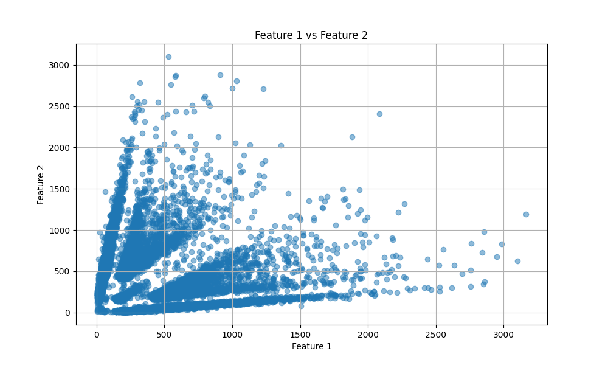

# Big Data Final Report

姓名: 楊秉宇 學號: R13922081

### The algorithm or method you used

這次我選擇用 KMeans 分群演算法來解決這題。KMeans 是一個很經典的分群方法，原理很簡單：它會先隨機選幾個點當作群中心，然後把每個資料點分配給離它最近的群中心，接著不斷調整群中心的位置，直到找到最好的分群結果。

## Why KMeans is suitable for this dataset 

KMeans 是最常見的分群方法之一，程式碼寫起來不複雜，而且跑得很快。對於這種需要分成很多群的任務（4n-1 個群），KMeans 的效率還不錯。

根據題目要求，幾維的資料就要分成 4n-1 個群。KMeans 可以很容易地設定我們要的群數，像是 4 維資料就分成 15 群，6 維資料就分成 23 群。

雖然 KMeans 有時候會因為初始點選得不好而得到不同結果，但我有設定隨機種子，讓每次跑出來的結果都一樣。

##  How it handles high-dimensional data

1. 資料準備與預處理

數據讀取：
本次數據集包含 "id" 欄位和多個數值特徵欄位。程式首先分離 ID 和數值，並對 features 進行標準化處理。

標準化：
使用 StandardScaler 將數據轉換為均值為 0、標準差為 1 的標準正態分佈。這樣可以消除不同 features 之間的差異，因為不同 features 的數值範圍可能差很多，如果不處理的話，數值比較大的 features 會主導分群結果。

程式會自動計算資料有幾個維度，然後設定群數為 4n-1。這樣不管是 4 維還是 6 維的資料，都能自動處理。

2. 參數設置

群數 (`n_clusters`)：設為 4n-1，像是 4 維資料就是 15 群
隨機種子 (`random_state`)：設為 40，確保每次跑的結果都一樣
標準化：用 StandardScaler 讓所有特徵在同一個尺度上

## Any preprocessing, hyperparameters, or assumptions involved

資料在某些維度組合下會呈現明顯的分群結構（像是第 1、2 維度可以看出 5 個群）。

KMeans 剛好擅長找這種有明顯中心的群集。
雖然 KMeans 比較適合圓形的群集，但透過標準化處理和合適的參數設定，在這個資料集上應該能得到不錯的結果。

## Github Repo

https://github.com/detaomega/BigData